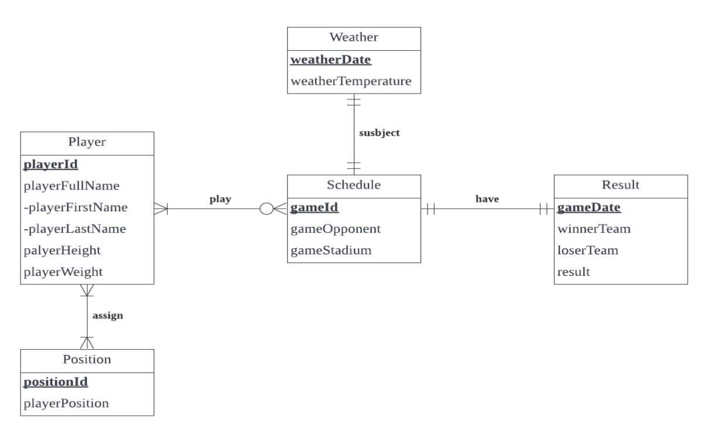

# Baseball Team Winning Rate Analysis

## Project Goal
* Employed Microsoft SQL Server to establish a database, integrating various data sources, performing data cleansing, and constructing specific queries to filter key data impacting the win rate
* Leveraged Tableau to develop intuitive visualizations and interactive dashboards, providing an in-depth analysis of the baseball team's performance to help improve the winning rate

## Tools Used
* Microsoft SQL Server
* Tableau

## ER Diagram for Database Structure

